<div align="center">

# Air Pollution Analytics Platform

### A cloud-native analytics platform for collecting, processing, deploying, and serving global air-quality data — built end-to-end with modern DevOps and backend engineering practices.

[](#)
[](#)
[](#)
[](#)
[](#)
[](#)
[](#)
[](#)
[](#)
[](#)
[](#)

[Overview](#-overview) • [Architecture](#-system-architecture) • [Tech Stack](#-technology-stack) • [CI/CD](#-cicd-pipeline) • [Observability](#-observability--monitoring-phase-2) • [Challenges](#-challenges--fixes) • [Screenshots](#-screenshots) • [API](#-rest-api-reference) • [Getting Started](#-getting-started)

</div>

---

## Overview

The **Air Pollution Analytics Platform** is a cloud-native backend system designed to demonstrate how a real production application is built, containerized, secured, tested, and continuously delivered — not just written and run locally.

At its core, the platform ingests a raw global air-quality dataset through a custom ETL pipeline, transforms and cleans it, loads it into MongoDB, and exposes the processed insights through a set of REST APIs. What makes this project stand out is everything *around* the application code: a fully automated Jenkins CI pipeline with static analysis and image scanning, GitOps-based deployment to Kubernetes via ArgoCD, and infrastructure that mirrors how air-quality or environmental monitoring data is handled in real production systems.

The goal was never to just "build an API" — it was to build the **entire delivery pipeline** a professional engineering team would use to ship it safely and repeatably.

The project was built in two phases: **Phase 1** established the application, the ETL pipeline, containerization, and GitOps delivery to Kubernetes. **Phase 2** hardened that same cluster for production and layered a full observability stack — Prometheus, Grafana, Node Exporter, and kube-state-metrics — on top of it, with the backend itself instrumented via Spring Boot Actuator and Micrometer.

---

## Key Features

- **ETL Pipeline** — Ingests and processes a global dataset of over **23,000 air-quality records**, performing extraction, cleaning, transformation, duplicate detection, and loading into MongoDB.
- **REST API Layer** — Spring Boot–powered endpoints serve pollution statistics, country/city-level breakdowns, and rankings of the most and least polluted cities.
- **Containerized Everywhere** — Every service (backend, ETL job, database) is built as a multi-stage Docker image, hardened for production use.
- **Kubernetes-Native Deployment** — Runs as Deployments, Jobs, and StatefulSets, backed by ConfigMaps, Secrets, Persistent Volumes, and a Horizontal Pod Autoscaler that scales the backend from 1 to 10 pods under load.
- **Automated CI Pipeline** — Jenkins builds, tests, scans, and ships every change automatically, with SonarQube for code quality and Trivy for image and filesystem vulnerability scanning.
- **GitOps Delivery with ArgoCD** — Infrastructure and application state are fully version-controlled; ArgoCD continuously reconciles the live cluster with what's committed to Git, with Slack/email notifications on every deployment.
- **Production-Grade Security Hardening** — Non-root containers, read-only root filesystems, dropped Linux capabilities, and enforced resource limits across every workload.
- **Infrastructure as Code** — AWS infrastructure is provisioned and version-controlled using Terraform.
- **Full Observability Stack** — Prometheus scrapes metrics from the backend, the cluster, and the nodes themselves; Grafana visualizes all of it through dashboards for application health, node resources, and cluster state.
- **Instrumented Application Layer** — Spring Boot Actuator and Micrometer expose JVM, HTTP, connection-pool, and GC metrics directly to Prometheus via `/actuator/prometheus`.

---

## System Architecture

The platform follows a GitOps delivery model: developers push code, Jenkins builds and validates it, and ArgoCD takes over from there — continuously syncing the Kubernetes cluster to match what's defined in Git.

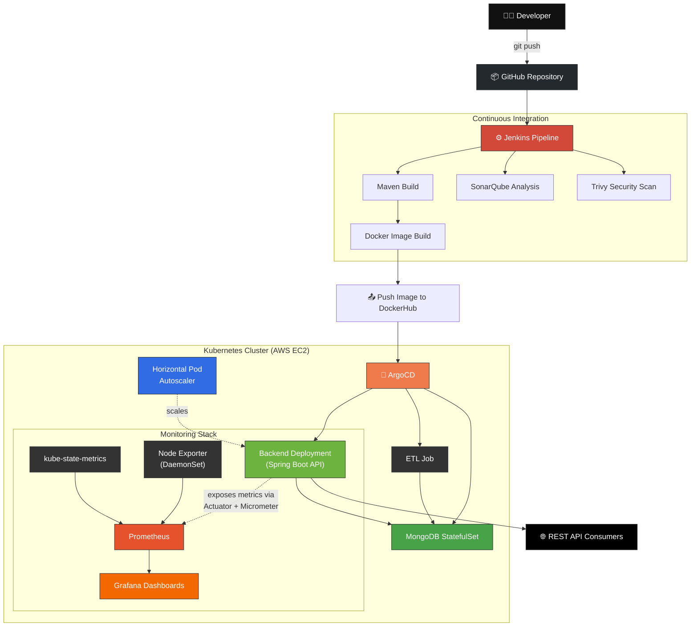

**How it works, end to end:**

1. A developer pushes a change to the GitHub repository.
2. Jenkins picks up the change, compiles the code, runs a SonarQube static-analysis scan, and runs Trivy against both the filesystem and the resulting Docker images.
3. Once the image passes all checks, Jenkins pushes it to DockerHub and updates the Kubernetes manifests in the GitOps repository.
4. ArgoCD detects the manifest change and automatically syncs the cluster — deploying the new backend version, running the ETL job, and keeping the MongoDB StatefulSet in sync.
5. The Horizontal Pod Autoscaler watches CPU utilization and scales the backend deployment between 1 and 10 replicas as traffic changes.
6. Prometheus continuously scrapes metrics from the backend (via Actuator), the nodes (via Node Exporter), and the cluster itself (via kube-state-metrics); Grafana turns all of it into live dashboards.
7. The REST API layer serves the processed pollution data to any consumer — dashboards, scripts, or other services.

---

## Technology Stack

| Layer | Technologies |
|---|---|
| **Backend** | Java 17, Spring Boot, Spring Data MongoDB, Maven |
| **Database** | MongoDB |
| **ETL** | OpenCSV, Java Streams, Batch Processing |
| **Containers** | Docker, Multi-stage builds |
| **Orchestration** | Kubernetes — Deployments, Jobs, Services, ConfigMaps, Secrets, StatefulSets, PVs, HPA, Ingress |
| **CI/CD** | Jenkins, SonarQube, Trivy, ArgoCD (GitOps) |
| **Observability** | Prometheus, Grafana, Node Exporter, kube-state-metrics, Spring Boot Actuator, Micrometer |
| **Infrastructure as Code** | Terraform |
| **Cloud** | AWS EC2 |

---

## Project Structure

```
Air-Pollution-Analytic-Platform/
├── backend/                # Spring Boot REST API & business logic
├── etl-pipeline/            # CSV reader, transformer, MongoDB loader
├── k8s/
│   ├── backend/             # Backend deployment manifests
│   ├── database/            # MongoDB StatefulSet manifests
│   ├── etl/                 # ETL Job manifests
│   └── base/                # Shared/base Kubernetes resources
├── monitoring/
│   ├── prometheus/           # Prometheus Deployment, Service, ConfigMap
│   ├── grafana/               # Grafana Deployment, Service, dashboards, datasource
│   ├── node-exporter/         # Node Exporter DaemonSet
│   ├── kube-state/            # kube-state-metrics RBAC, Deployment, Service
│   └── base/                  # Shared monitoring namespace/resources
├── argoCD/
│   ├── applications/        # Individual ArgoCD Application definitions
│   ├── appOfApps/            # App-of-Apps root application
│   └── notifications/        # ArgoCD notification triggers/templates
├── terraform/                # AWS infrastructure provisioning
├── Jenkinsfile                # CI/CD pipeline definition
└── docker-compose.yml         # Local multi-container setup
```

---

## CI/CD Pipeline

Every commit runs through a fully automated pipeline before it ever reaches the cluster:


The pipeline stage view below shows this running live in Jenkins, with each stage's execution time tracked across builds:

<p align="center">
  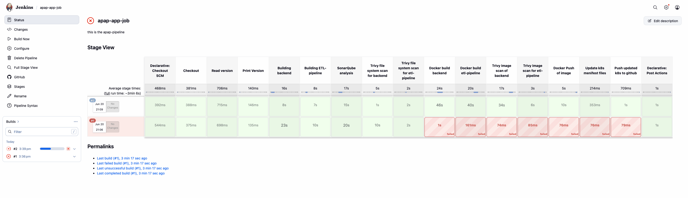
</p>

Deployment notifications are sent automatically on every successful sync, so the team always knows the current state of the cluster:

<p align="center">
  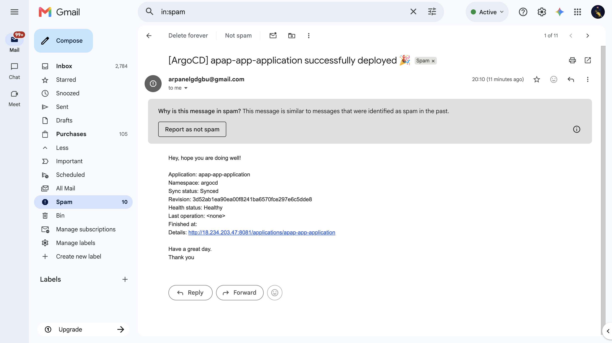
</p>

---

## Observability & Monitoring (Phase 2)

Phase 1 got the application running in Kubernetes. Phase 2 answers the next question every production system needs to answer: **how do you know it's actually healthy?**

The entire monitoring stack — Prometheus, Grafana, Node Exporter, and kube-state-metrics — was built from scratch as production-style Kubernetes manifests and deployed into its own `monitoring` namespace, fully wired into the same GitOps pipeline as the application itself.

### Kubernetes Hardening

Every workload in the cluster — application and monitoring alike — runs under an explicit security context rather than default (and dangerously permissive) settings:

```yaml
securityContext:
  runAsNonRoot: true
  allowPrivilegeEscalation: false
  capabilities:
    drop:
      - ALL
```

Alongside this, every deployment defines:

- Read-only root filesystems where the workload allows it, with `fsGroup` set correctly for mounted volumes
- Resource **requests and limits** on every container
- **Startup, readiness, and liveness probes** so Kubernetes can accurately track pod health instead of guessing
- ServiceAccount token auto-mounting disabled wherever a pod has no need to talk to the Kubernetes API

### Persistent Storage

Prometheus and Grafana both need to retain data across restarts, so persistent storage was configured for each:

- Persistent Volumes and Persistent Volume Claims
- Dedicated Storage Classes
- HostPath-backed volumes for the local Kind-based development cluster

### Prometheus

Built as a first-class citizen of the cluster — its own Deployment, Service, ConfigMap, persistent storage, health probes, and security context — configured to scrape:

- Itself (Prometheus)
- **Node Exporter** — host-level metrics
- **kube-state-metrics** — Kubernetes object state
- **The Spring Boot backend** — application-level metrics via Actuator

All four targets report healthy and `UP`:

<p align="center">
  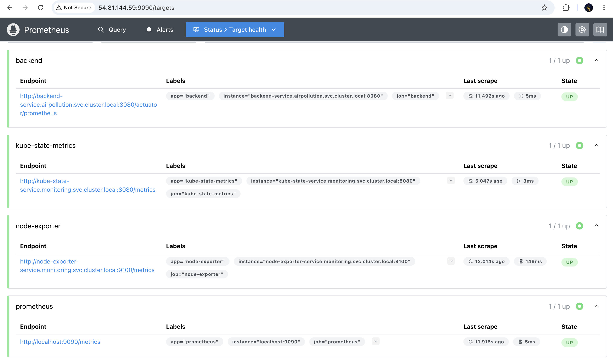
</p>

### Node Exporter

Deployed as a **DaemonSet** (one pod per node, by design) alongside its Service, collecting host-level CPU, memory, network, filesystem, and disk I/O metrics. Visualized through the community-standard "Node Exporter Full" Grafana dashboard:

<p align="center">
  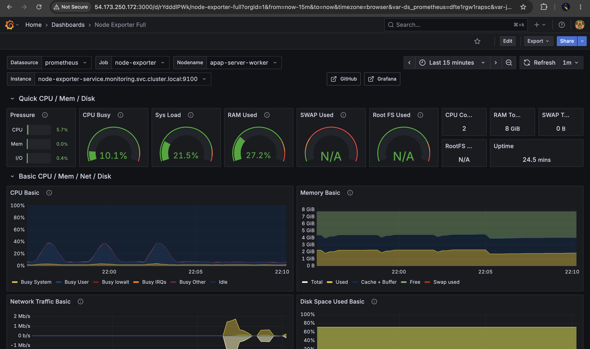
</p>

### kube-state-metrics

Deployed with its own ServiceAccount, ClusterRole, and ClusterRoleBinding (least-privilege RBAC), exposing the state of Kubernetes objects themselves — Pods, Deployments, ReplicaSets, StatefulSets, DaemonSets, Nodes, Services, PVs, PVCs, Jobs, and CronJobs — to Prometheus:

<p align="center">
  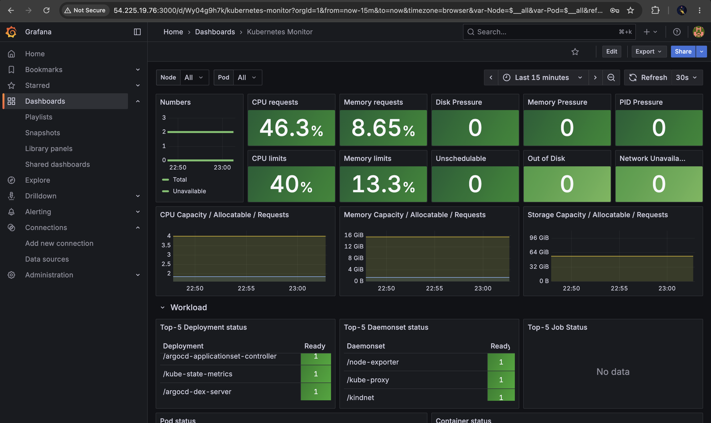
</p>

### Grafana

Configured with persistent storage, secrets for credentials, and a provisioned Prometheus datasource, with three dashboards imported: **Node Exporter Full**, **Kubernetes Monitor**, and a custom **Spring Boot Statistics** dashboard covering JVM heap, non-heap memory, CPU usage, load average, open files, and HikariCP connection pool stats:

<p align="center">
  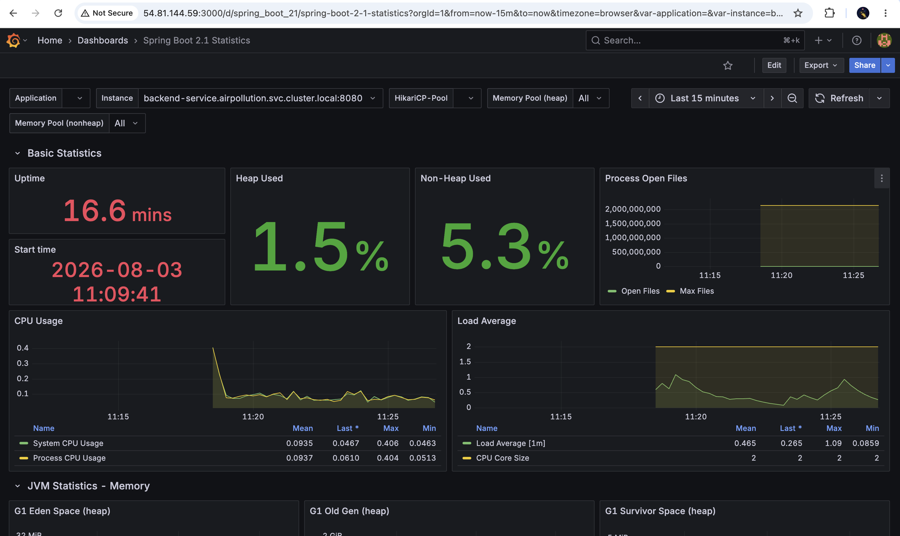
</p>

### Spring Boot Application Instrumentation

The backend was instrumented directly rather than monitored purely at the infrastructure level. **Spring Boot Actuator** and **Micrometer** expose a Prometheus-scrapeable endpoint:

```
/actuator/prometheus
```

which reports JVM and heap usage, CPU, HTTP request metrics, HikariCP connection-pool stats, garbage collection, thread counts, uptime, and memory — the same signals a production on-call engineer would actually look at.

Confirmed live in the cluster, with the full monitoring namespace running cleanly:

<p align="center">
  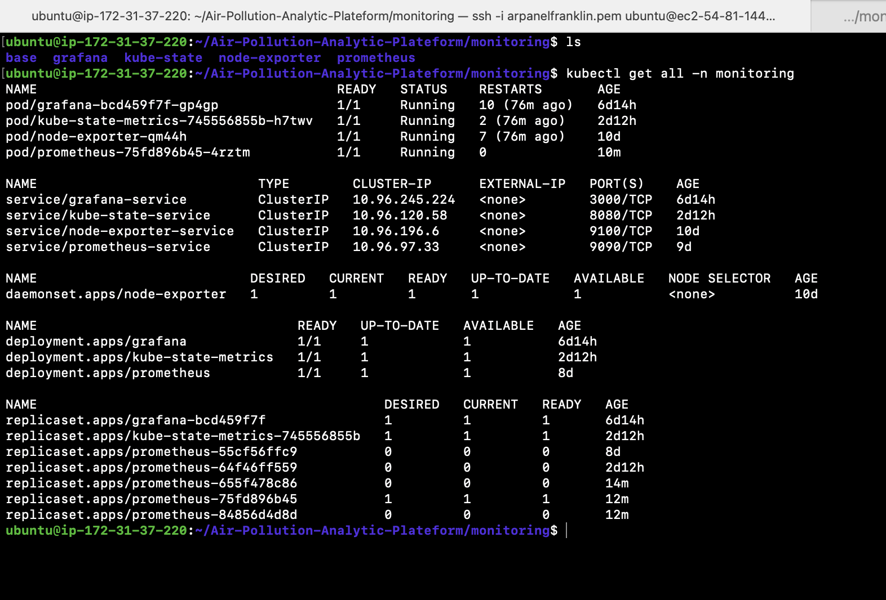
</p>

---

## Challenges & Fixes

Most of Phase 2 wasn't writing YAML from a tutorial — it was debugging why the YAML didn't work. A few of the real issues hit and resolved along the way:

| Challenge | Resolution |
|---|---|
| **PVC binding failures** | Diagnosed mismatched Storage Class and access modes; corrected volume claim specs so Prometheus and Grafana could bind reliably |
| **HostPath permission errors** | Resolved ownership/permission mismatches between the host path and the container's non-root user via correct `fsGroup` configuration |
| **Prometheus & Grafana storage permissions** | Fixed write-permission failures on mounted volumes caused by running as non-root without matching filesystem group ownership |
| **ConfigMap mounting issues** | Corrected volume mount paths and key references so Prometheus picked up its scrape configuration correctly |
| **Spring Boot Actuator integration** | Debugged missing `/actuator/prometheus` exposure — resolved by correcting Actuator and Micrometer dependency and exposure configuration |
| **Prometheus scrape configuration** | Fixed incorrect service DNS names and job definitions that were silently preventing targets from being discovered |
| **RBAC for kube-state-metrics** | Diagnosed missing ClusterRole permissions causing metrics gaps; corrected the ClusterRoleBinding |
| **Probe failures** | Tuned startup/readiness/liveness probe timing to stop Kubernetes from killing pods that were still legitimately starting up |
| **Service discovery issues** | Traced and fixed DNS resolution problems between Prometheus and its scrape targets inside the cluster |
| **Jenkins rebuild & redeploy loops** | Debugged stale pipeline state causing repeated failed builds; fixed by correcting the Jenkinsfile stage dependencies |
| **ArgoCD sync failures** | Resolved `OutOfSync`/`SyncError` states caused by manifest drift between Git and the live cluster |

---

## Security Features

Security wasn't an afterthought — it's built into every layer of the stack.

**Docker**
- Multi-stage builds to keep runtime images minimal
- Non-root container users
- No unnecessary build tooling shipped in the final image

**Kubernetes**
- Non-root pods with read-only root filesystems
- Linux capability dropping
- Enforced resource requests and limits on every workload
- Secrets and ConfigMaps for sensitive and environment-specific configuration
- Liveness/readiness health probes with rolling update strategy

**Pipeline**
- SonarQube static code analysis on every build
- Trivy scanning of both the filesystem and final container images before they're ever pushed

---

## Deployment

The platform is deployed on **AWS EC2**, running a self-hosted Kubernetes cluster with ArgoCD managing continuous delivery. Every application — the backend, the ETL job, and the MongoDB StatefulSet — is defined as its own ArgoCD Application under an App-of-Apps root, meaning the entire environment can be reconstructed from Git alone.

<p align="center">
  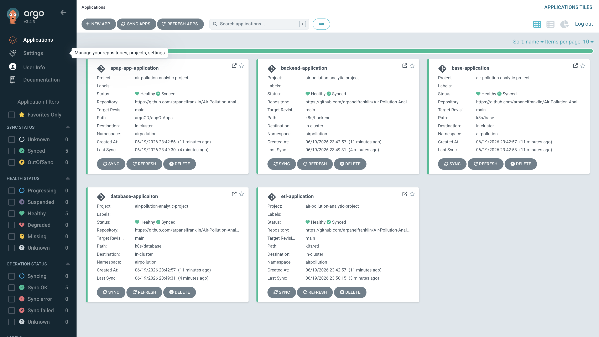
</p>

Once deployed, `kubectl get all -n airpollution` confirms the full stack running cleanly — backend, ETL job, MongoDB StatefulSet, services, and the autoscaler — all healthy in the cluster:

<p align="center">
  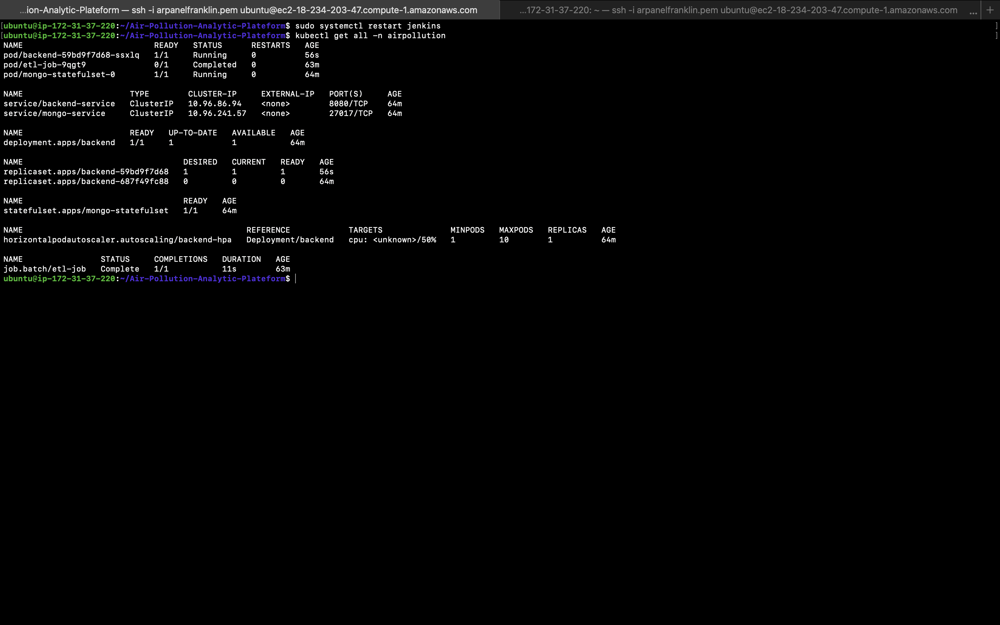
</p>

---

## REST API Reference

| Method | Endpoint | Description |
|---|---|---|
| `GET` | `/pollution` | Returns all pollution records |
| `GET` | `/pollution/country/{country}` | Returns pollution data for a specific country |
| `GET` | `/pollution/city/{city}` | Returns pollution data for a specific city |
| `GET` | `/pollution/stats` | Returns overall aggregate statistics |
| `GET` | `/pollution/top-cities` | Returns the most polluted cities |
| `GET` | `/pollution/cleanest-cities` | Returns the least polluted cities |

The screenshot below shows a live response from the deployed `/pollution` endpoint on the production EC2 instance:

<p align="center">
  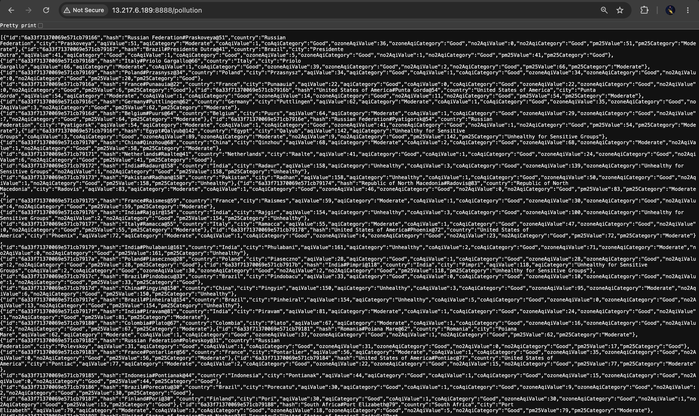
</p>

---

## Dataset

The ETL pipeline processes a global air-quality dataset containing more than **23,000 records** spanning cities and countries worldwide. For each record, it performs:

1. **Extraction** — Reading raw CSV data
2. **Cleaning** — Removing malformed or incomplete entries
3. **Transformation** — Normalizing AQI values and categories across pollutants (PM2.5, ozone, CO, NO₂)
4. **Duplicate Detection** — Ensuring each city/country pair is loaded once
5. **Loading** — Persisting the final structured records into MongoDB

---

## Screenshots

> All screenshots below were captured from the live, deployed environment.

| | |
|---|---|
| **Jenkins Pipeline — Full Stage View** | **ArgoCD Applications Dashboard** |
|  |  |
| **ArgoCD Application Details Tree** | **Kubernetes Resources (kubectl)** |
| 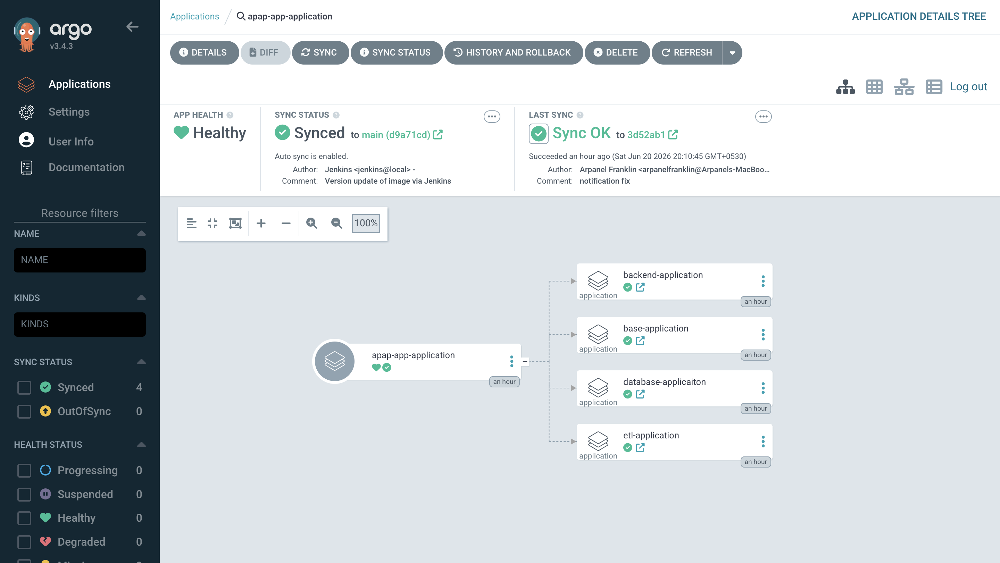 |  |
| **Live API Response** | **ArgoCD Sync Status (CLI)** |
|  | 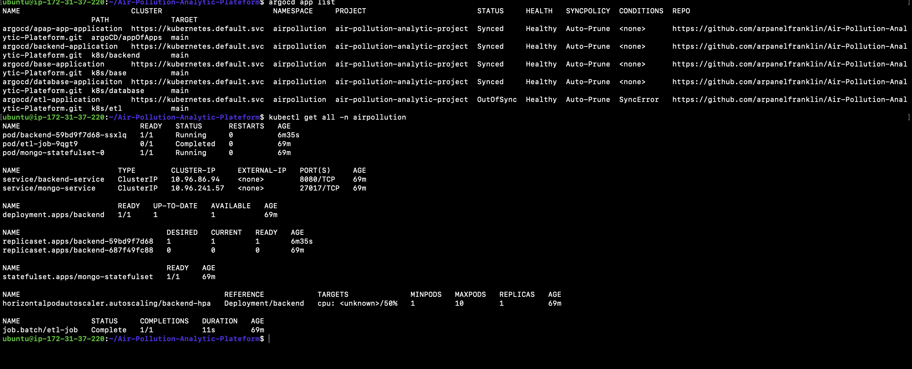 |
| **Prometheus Scrape Targets** | **Grafana — Spring Boot Statistics** |
|  |  |
| **Grafana — Node Exporter Full** | **Grafana — Kubernetes Monitor** |
|  |  |
| **`kubectl get all -n monitoring`** | |
|  | |

> 📁 To use these embeds as-is, add your screenshots to an `assets/screenshots/` folder in the repository using the filenames referenced above.

---

## Getting Started

```bash
# Clone the repository
git clone https://github.com/arpanelfranklin/Air-Pollution-Analytic-Plateform.git
cd Air-Pollution-Analytic-Plateform

# Run locally with Docker Compose
docker-compose up --build

# Or deploy to Kubernetes via the base manifests
kubectl apply -f k8s/base/
kubectl apply -f k8s/database/
kubectl apply -f k8s/etl/
kubectl apply -f k8s/backend/
```

For GitOps-managed deployment, apply the ArgoCD App-of-Apps definition instead — it will bootstrap every child application automatically:

```bash
kubectl apply -f argoCD/appOfApps/
```

---

## Roadmap

**Phase 1 — Application & GitOps Delivery** ✅
Backend, ETL pipeline, containerization, Kubernetes deployment, Jenkins CI, ArgoCD GitOps.

**Phase 2 — Production Hardening & Observability** ✅
Kubernetes security hardening, persistent storage, Prometheus, Grafana, Node Exporter, kube-state-metrics, Spring Boot Actuator/Micrometer instrumentation.

**Phase 3 — Alerting & Distributed Tracing** 🔜
- **Alertmanager** for incident alerting on top of the existing Prometheus setup
- **Loki + Promtail** for centralized, queryable log aggregation
- **OpenTelemetry** for distributed tracing across the backend and ETL pipeline
- Argo Rollouts for blue-green and canary deployments
- A dedicated React-based analytics frontend

---

## Purpose

This project was built to go beyond writing an application — the focus was on understanding how modern software is actually **built, tested, secured, deployed, and operated** in production, using the same tools and workflows real engineering teams rely on every day.

---

## Author

**Arpanel Franklin**
Backend & DevOps Engineer

[](https://linkedin.com/in/arpanel-franklin-a5613a368)
[](https://arpanelfranklin.in)
[](https://github.com/arpanelfranklin)

---

<div align="center">

### ⭐ If this project helped you understand real-world DevOps practices, consider giving it a star.

</div>